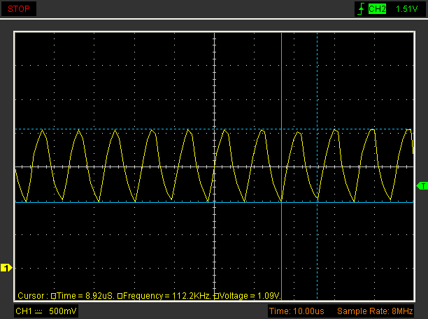
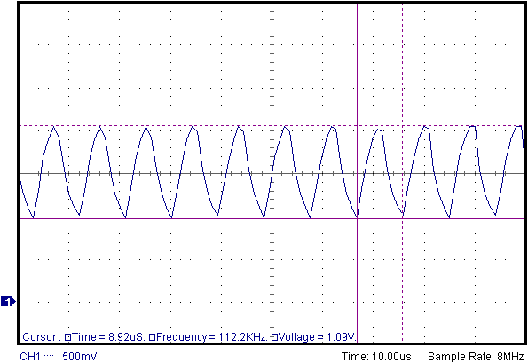
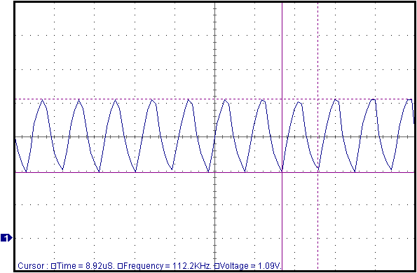
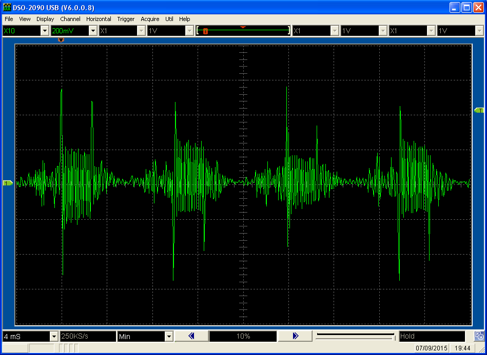
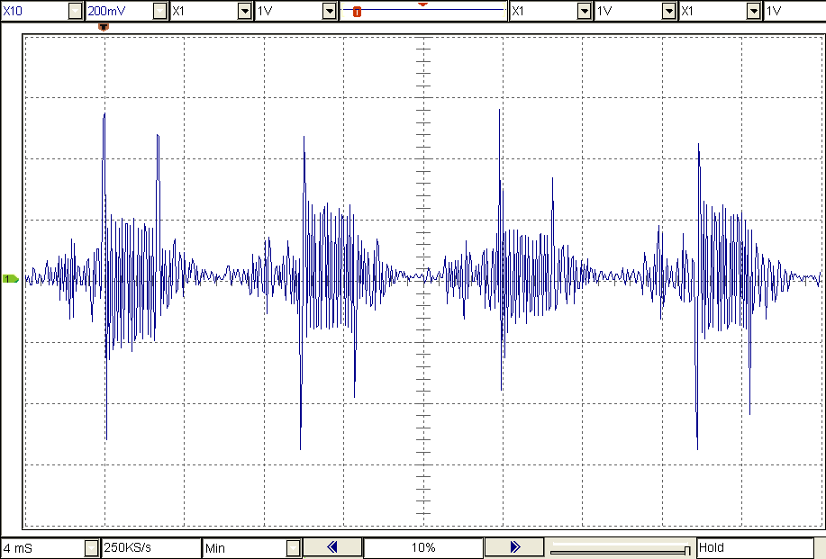
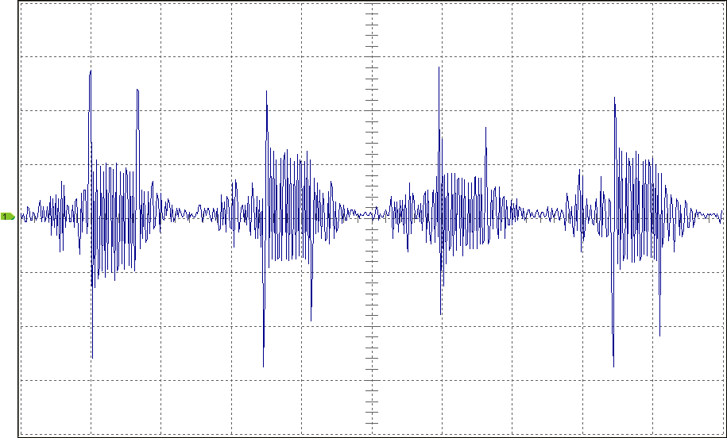
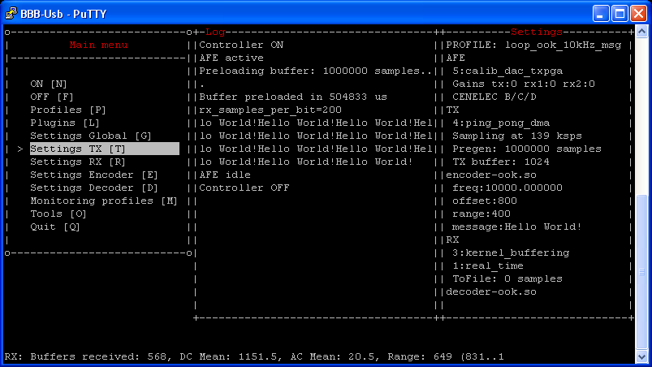
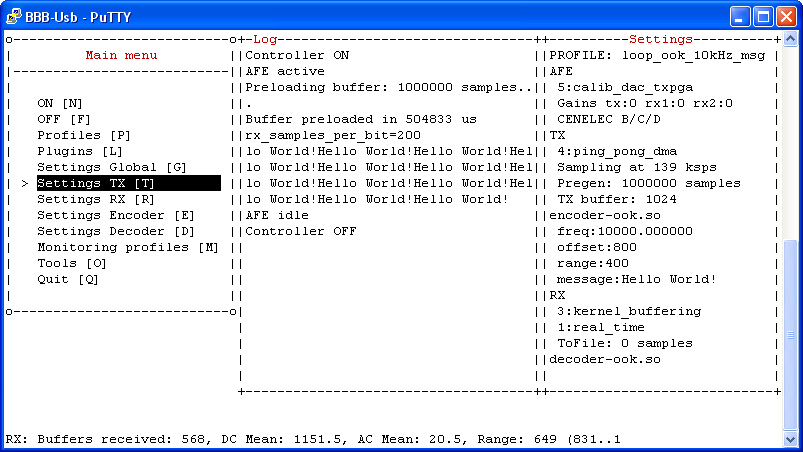

# APPLICATION-BASED PROFILES

Profiles that define conversions of images produced by specific applications 

## HANTEK 6022

### Hantek6022_Capture_RecolorAndCropToAnnotations

Converts the dark background to white background (and other elements) for a more paper-friendly
look. It also removes the unnecessary background, cropping until the graph + annotations

SOURCE | RESULT
------ | ------
Hantek6022.png | Hantek6022_RecolorAndCropToAnnotations.png
 | 

### Hantek6022_Capture_RecolorAndCropToGraph

Like _Hantek6022_Capture_RecolorAndCropToAnnotations_ but also removing the annotations

SOURCE | RESULT
------ | ------
Hantek6022.png | Hantek6022_RecolorAndCropToGraph.png
 | 

## HANTEK DSO2090

### HantekDso2090_Capture_RecolorAndCropToAnnotations

Like _Hantek6022_Capture_RecolorAndCropToAnnotations_ but for captures from the Hantek DSO-2090
model

SOURCE | RESULT
------ | ------
HantekDso2090.png | HantekDso2090_RecolorAndCropToAnnotations.png
 | 

### HantekDso2090_Capture_RecolorAndCropToGraph

Like _HantekDso2090_Capture_RecolorAndCropToAnnotations_ but also removing the annotations

SOURCE | RESULT
------ | ------
HantekDso2090.png | HantekDso2090_RecolorAndCropToGraph.png
 | 

## PUTTY

### Putty_Screenshot_Recolor

Changes the colors of a typical Putty capture (with black background) to a more paper-friendly
version (with white background)

SOURCE | RESULT
------ | ------
Putty.png | Putty_Recolor.png
 | 
