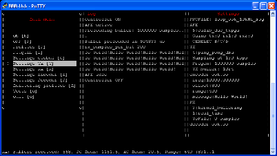
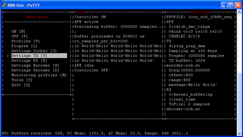
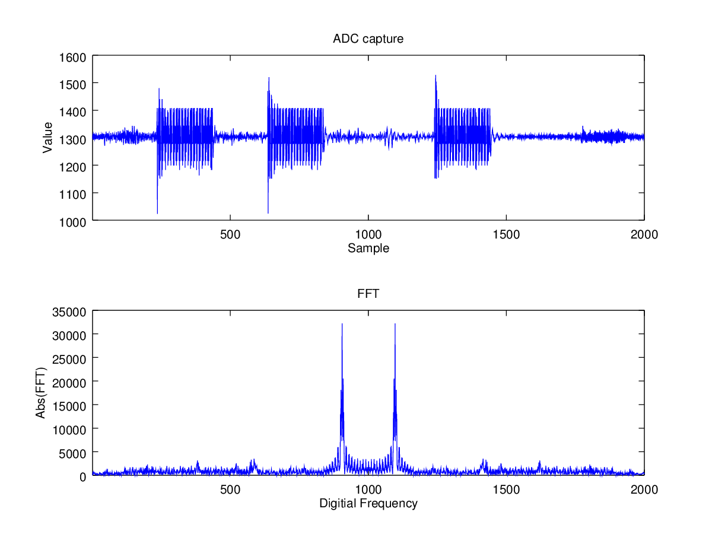
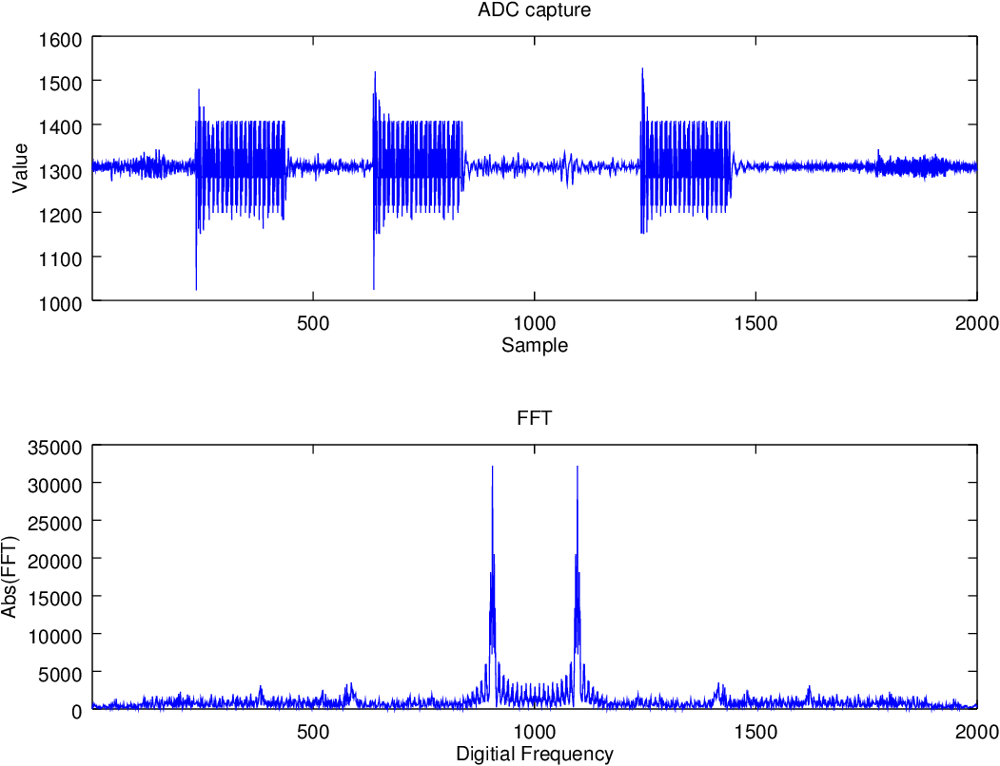
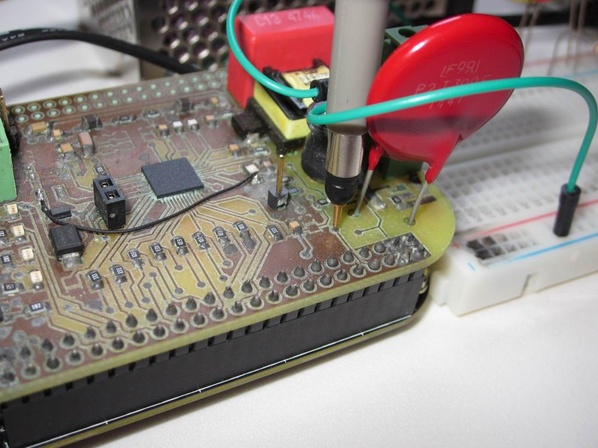
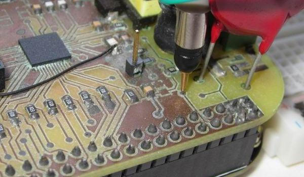
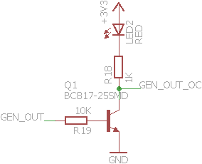
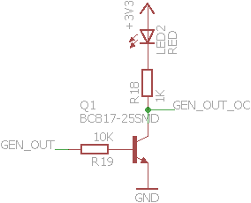
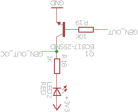
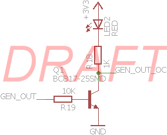

# NATIVE PROFILES

Generic purpose profiles offered natively by the application

## ResizeToAbsoluteDimensions

Resizes images using the default interpolation algorithm.

It expects _ExtraData_ to configure the conversion. Examples:
* *W=1024*: Resizes width to 1024 pixels keeping aspect ratio
* *H=800*: Resizes height to 800 pixels keeping aspect ratio
* *1024x800*: Resizes to absolute dimensions 1024 pixels width, 800 pixels height
* *50%*: Resizes to 50%
* *50%x25%*: Resizes width to 50% and height to 25%

SOURCE | RESULT
------ | ------
 | 

## ResizeToAbsoluteDimensionsHQ

Like _ResizeToAbsoluteDimensions_ but using a HighQuality interpolation algorithm

SOURCE | RESULT
------ | ------
 | 

## CropBackground

Removes the background border of the image. To do so, this function gets the color of pixel at
coordinates (0,0) and removes left, right, top and bottom margins while using that color

SOURCE | RESULT
------ | ------
 | 

## CropDimensions

Crops a specific amount of pixels.

It expects _ExtraData_ to configure the conversion. Examples:
* *10,20,30,40*: Crops 10 pixels at left, 20 at top, 30 at right and 40 at bottom

SOURCE | RESULT
------ | ------
 | 

## MakeBackgroundTransparent

Gets the color at coordinates (0,0) and makes transparent all the pixels with that color

SOURCE | RESULT
------ | ------
 | 

## Rotate180

Rotates the image by 180º degrees

SOURCE | RESULT
------ | ------
 | 

## AddWatermark

Adds a semi-transparent centered "DRAFT" watermark

SOURCE | RESULT
------ | ------
 | 
