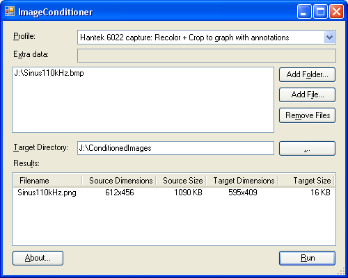

# ImageConditioner

Mini tool to condition a batch of images applying a customized transformation that can be
comfortably programmed in C#

## MOTIVATION

When I was working in the documentation of a project, I faced the need to adapt some images coming
from software tools for a more paper-friendly look (removing dark backgrounds) or a more suitable
format (PNG preferred over BMP).

It was a repetitive operation because I always had the same type of source images. 

For example, I had to convert a large BMP (~ 1 MB) from a USB-based oscilloscope tool to a much
smaller PNG format (~ 10 KB). I had also the need to crop that image removing unnecessary details.
Finally, I required to remap some colors for a better look.

I looked for freeware tools and found some but it always existed some not supported operation or
restriction, or the interaction with the tool required too much steps to do the conversion.

So, I decided to create this simple project in C# and make it public just in case somebody else can
benefit from.

## MAIN FEATURES

### Customization

If you have a specific image customization which is not covered by the current software, you can
easily add your own conversion function taking advantage of the functionalities offered by the C#
language and the mini-framework provided by the tool.

### Reflection

To simplify the addition of new functionality this tool relies on C# Reflection. This way, to add a
new custom transformation you just need to add a new C# function to the project. Then, it will
automatically appear in the GUI as a new available profile

### Running modes

It supports three running modes:

* **Interactive GUI**: a dialog allows to easily configure the conversion and images involved  
* **Console-based**: operated through the command line. A console window notifies about the
progress of the conversion
* **Quiet-mode**: it silently executes the conversion without any interaction. Only the result
of the complete operation is returned (OK or NOK)

## GUI

The GUI is very simple and spartan:

You can see:
* a ComboBox to select the conversion profile (either existing or your own)
* a TextBox with Extra Data to add some profile parameters, if required
* a ListBox with the list of images to be converted in batch. You can add files there selecting
folders or specific files. Drag & Drop is also supported
* a TextBox to specify the target folder where to store the converted images
* a ListBox with the results of the conversion

## COMMAND-LINE

The command-line specifies the conversion parameters for the console-based operation or the default
settings for the GUI dialog.
You can get this information by using the _/?_ option:

	Command line options:
	/P:Profile identifier
	/S:Source directory
	/T:Target directory
	/C for console-based execution
	/Q for quiet mode
	/? to show this help message

## CONDITIONING PROFILES

The tool offers profiles for:
* resizing
* remapping colors
* cropping
* making the background transparent
* rotating
* ...

These profiles are currently divided in three C# files (click on the links for detailed
information): 

* _ProfilesNative.cs_: [Native profiles](ImageConditioner/ProfilesNative.md)
* _ProfilesApplications.cs_: [Application-based profiles](ImageConditioner/ProfilesApplications.md)
* _ProfilesPrivate.cs_: [Private profiles](ImageConditioner/ProfilesPrivate.md)

To add a new profile just duplicate one of the existing functions within these files, change the
function name and implement your code. It's quite intuitive

## INSTALL

* Download source code from [ImageConditioner at GitHub](https://github.com/jose77105/ImageConditioner)
* Open the _ImageConditioner.sln_ with Visual Studio (developed with Visual Studio 2005)
* Compile and run it

I have tested the application in Windows XP SP3 and Windows 10.

## DEPENDENCIES

* Windows >= XP
* Visual Studio >= 2005
* .NET: System, System.Drawing, System.Windows.Forms

## VERSIONS

[Changelog](CHANGELOG.md)

## LICENSE

<pre>
    This program is free software: you can redistribute it and/or modify
    it under the terms of the GNU General Public License as published by
    the Free Software Foundation, either version 3 of the License, or
    (at your option) any later version.

    This program is distributed in the hope that it will be useful,
    but WITHOUT ANY WARRANTY; without even the implied warranty of
    MERCHANTABILITY or FITNESS FOR A PARTICULAR PURPOSE.  See the
    GNU General Public License for more details.

    You should have received a copy of the GNU General Public License
    along with this program.  If not, see <http://www.gnu.org/licenses/>.
</pre>
For full terms see [LICENSE](LICENSE)

## COPYRIGHT

Copyright (C) 2017 Jose Maria Ortega (<a href="mailto:jose77105@gmail.com">jose77105@gmail.com</a>)
